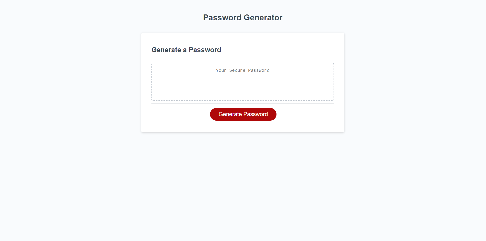

# Password Generator

## Description

This repo contains the content for week 3

- I wanted to create a tool that can randomly generate secure passwords, as specified by the users selected criteria
- The application can take a user's inputs, and apply those to make a completely randomized password.
- I learned more about functions, although I still have much to learn about how they work and exactly what inputs to use it what scenarios. In particular, I feel I have a much better understanding aboout how to use variables, and I better understand the signifigance of global variables, as opposed to local ones.

## Installation

- Link to deployed website: 

- Get SSH key from https://github.com/Luwylbab/Password-Generator

- Clone the repository using [git clone git@github.com:Luwylbab/Password-Generator.git]

## Usage

Once a user is on the webpage, they can click the red "Generate Password" button. Once the button is clicked, a prompt will appear an ask for the amount of characters the user would like the password to be, to which the user can select any number between 8 and 124. If the user selects a number less than 8, or greater than 124, they will be given an error message. After the character count is selected, the user will be faced with a series of prompts asking to use uppercase, lowercase, numbers, and/or special characters. Each of these prompts have two options, "OK" for yes, and "Cancel" for no. Once the user has navigated through all the prompts, a random, secure password will be generated and dispayed both in the prompt and in the box on the webpage.

 

## Credits

Starter Code: 
https://github.com/coding-boot-camp/friendly-parakeet

Used Xpert Learning Assistant to help with writing functions and variables: 
https://bootcampspot.instructure.com/courses/4612/external_tools/313

Used W3 Schools to help understand JavaScript: 
https://www.w3schools.com/js/js_functions.asp
https://www.w3schools.com/js/js_number_methods.asp 
https://www.w3schools.com/js/js_string_methods.asp 
https://www.w3schools.com/js/js_statements.asp 

